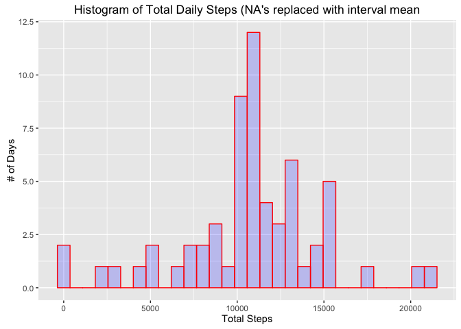

# Reproducible Research: Peer Assessment 1

## Setup our environment


```r
  setwd("~/R/Coursera/ReproducibleResearch/RepData_PeerAssessment1")
  library(ggplot2)
```

```
## Warning: package 'ggplot2' was built under R version 3.2.4
```

```r
  library(dplyr)
```

```
## 
## Attaching package: 'dplyr'
```

```
## The following objects are masked from 'package:stats':
## 
##     filter, lag
```

```
## The following objects are masked from 'package:base':
## 
##     intersect, setdiff, setequal, union
```

## Loading and preprocessing the data


```r
setwd("~/R/Coursera/ReproducibleResearch/RepData_PeerAssessment1")
activityData <- read.csv(unz("activity.zip", "activity.csv"))
activityData <- mutate(activityData,date=as.Date(date,"%Y-%m-%d"))
str(activityData)
```

```
## 'data.frame':	17568 obs. of  3 variables:
##  $ steps   : int  NA NA NA NA NA NA NA NA NA NA ...
##  $ date    : Date, format: "2012-10-01" "2012-10-01" ...
##  $ interval: int  0 5 10 15 20 25 30 35 40 45 ...
```

## What is mean total number of steps taken per day?

First we will calculate the total steps per day, excluding NA's.


```r
sums <- activityData %>%
  group_by(date) %>%
  summarize(steps=sum(steps, na.rm=TRUE))

head(sums)
```

```
## Source: local data frame [6 x 2]
## 
##         date steps
##       (date) (int)
## 1 2012-10-01     0
## 2 2012-10-02   126
## 3 2012-10-03 11352
## 4 2012-10-04 12116
## 5 2012-10-05 13294
## 6 2012-10-06 15420
```

Let's see what that looks like in a histogram.


```r
qplot(sums$steps,
      main = "Histogram of Total Daily Steps",
      xlab = "Total Steps",
      ylab = "# of Days",
      fill = I("blue"),
      col = I("red"),
      alpha = I(0.2)
)
```

```
## `stat_bin()` using `bins = 30`. Pick better value with `binwidth`.
```

<!-- -->

Summary statistics of the daily totals - including mean and median.


```r
summary(sums)
```

```
##       date                steps      
##  Min.   :2012-10-01   Min.   :    0  
##  1st Qu.:2012-10-16   1st Qu.: 6778  
##  Median :2012-10-31   Median :10395  
##  Mean   :2012-10-31   Mean   : 9354  
##  3rd Qu.:2012-11-15   3rd Qu.:12811  
##  Max.   :2012-11-30   Max.   :21194
```

## What is the average daily activity pattern?

First we will calculate the interval averages across all days.


```r
intervalAverages <- activityData %>%
  group_by(interval) %>%
  summarize(steps = mean(steps, na.rm=TRUE))

head(intervalAverages)
```

```
## Source: local data frame [6 x 2]
## 
##   interval     steps
##      (int)     (dbl)
## 1        0 1.7169811
## 2        5 0.3396226
## 3       10 0.1320755
## 4       15 0.1509434
## 5       20 0.0754717
## 6       25 2.0943396
```

Create a time series graph of average daily steps in each interval.


```r
qplot(intervalAverages$interval,
      intervalAverages$steps,
      geom="line",
      color=I("red"))
```

<!-- -->

Which interval has the maximum average number of steps?


```r
intervalAverages[which.max(intervalAverages$steps),]
```

```
## Source: local data frame [1 x 2]
## 
##   interval    steps
##      (int)    (dbl)
## 1      835 206.1698
```

## Imputing missing values

How many NA's are there in the data?


```r
sum(is.na(activityData$steps))
```

```
## [1] 2304
```

In order to handle NA's, I'm going to replace them with the mean
number of steps in the same interval from other days.


```r
  activityData.NA.processed <- activityData %>% 
            group_by(interval) %>%
            mutate(steps=replace(steps, is.na(steps), mean(steps,na.rm=TRUE)))

  head(activityData.NA.processed)
```

```
## Source: local data frame [6 x 3]
## Groups: interval [6]
## 
##       steps       date interval
##       (dbl)     (date)    (int)
## 1 1.7169811 2012-10-01        0
## 2 0.3396226 2012-10-01        5
## 3 0.1320755 2012-10-01       10
## 4 0.1509434 2012-10-01       15
## 5 0.0754717 2012-10-01       20
## 6 2.0943396 2012-10-01       25
```

Let's check a histogram of the new processed dataset.


```r
sums <- activityData.NA.processed %>%
  group_by(date) %>%
  summarize(steps=sum(steps, na.rm=TRUE))

qplot(sums$steps,
      main = "Histogram of Total Daily Steps (NA's replaced with interval mean",
      xlab = "Total Steps",
      ylab = "# of Days",
      fill = I("blue"),
      col = I("red"),
      alpha = I(0.2)
)
```

```
## `stat_bin()` using `bins = 30`. Pick better value with `binwidth`.
```

<!-- -->

How do the mean and median look for the new dataset?


```r
summary(sums)
```

```
##       date                steps      
##  Min.   :2012-10-01   Min.   :   41  
##  1st Qu.:2012-10-16   1st Qu.: 9819  
##  Median :2012-10-31   Median :10766  
##  Mean   :2012-10-31   Mean   :10766  
##  3rd Qu.:2012-11-15   3rd Qu.:12811  
##  Max.   :2012-11-30   Max.   :21194
```

We can see that the when days were included that were all NA, they were
being counted as zero step days in the results.  The new distribution is
a better representation of actual activity.

## Are there differences in activity patterns between weekdays and weekends?

Add a factor variable indicating whether an observation is a weekday or 
weekend.


```r
  activityData.NA.processed$dayType <- 
    as.factor(
      ifelse(weekdays(activityData.NA.processed$date) %in% c("Saturday","Sunday"),
           "weekend","weekday")
    )

  head(activityData.NA.processed)
```

```
## Source: local data frame [6 x 4]
## Groups: interval [6]
## 
##       steps       date interval dayType
##       (dbl)     (date)    (int)  (fctr)
## 1 1.7169811 2012-10-01        0 weekday
## 2 0.3396226 2012-10-01        5 weekday
## 3 0.1320755 2012-10-01       10 weekday
## 4 0.1509434 2012-10-01       15 weekday
## 5 0.0754717 2012-10-01       20 weekday
## 6 2.0943396 2012-10-01       25 weekday
```

Average by interval and day type, then plot in a panel.


```r
intervalAverages <- activityData.NA.processed %>%
  group_by(interval,dayType) %>%
  summarize(steps = mean(steps, na.rm=TRUE))

qplot(data=intervalAverages,
      interval,steps,
      geom="line",
      facets=dayType ~ .,
      color=I("red"))
```

<!-- -->

